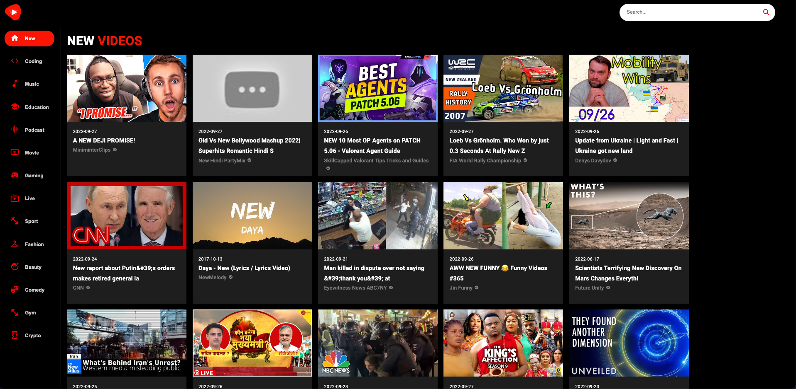

<!-- PROJECT LOGO -->
<br />
<p align="center">
    


  <h3 align="center">YOUTUBE CLONE</h3>

  <p align="center">
    A responsive React JS application consisting of video sections, custom categories, channel pages and you can play videos straight from your YouTube Clone App!  
    <br />
    <br />
    · <a href="#" target="_blank">View Demo</a>
    ·
  </p>
</p>

<br>



<br>

<!-- TABLE OF CONTENTS -->
<details open="open">
  <summary>Table of Contents</summary>
  <ol>
    <li>
      <a href="#about-the-project">About The Project</a>
      <ul>
        <li><a href="#built-with">Built With</a></li>
        <li><a href="#naming-conventions">Naming Conventions</a></li>
      </ul>
    </li>
    <li>
      <a href="#getting-started">Getting Started</a>
      <ul>
        <li><a href="#installation">Installation</a></li>
      </ul>
    </li>
    <li><a href="#contact">Contact</a></li>
  </ol>
</details>

<br>

<!-- ABOUT THE PROJECT -->

## About The Project

<br>

### Built With

- [React.js](https://reactjs.org/)
- [MUI](https://mui.com/)
- [RapidAPI - Youtube v3](https://rapidapi.com/ytdlfree/api/youtube-v31/)

<br>


### Naming Conventions

| Name        | Example          | Usage                |
| ----------- | ---------------- | -------------------- |
| kebab case  | is-not-a-dish    | style classes        |
| pascal case | AllInOneCapitals | components           |
| camel case  | goesDownThenUp   | jsx variables, utils |

<br>
<!-- GETTING STARTED -->

## Getting Started

### Installation

1. Clone the repo
   ```sh
   git clone https://github.com/cimp08/youtube-clone
   ```
2. Install NPM packages (In the client and server folders)
   ```sh
   npm install
   ```
3. Create .env
   ```JS
   REACT_APP_RAPID_API_KEY = ENTER KEY ID
   ...
   ```
4. Run
   ```sh
   npm start
   ```

<br>


<!-- CONTACT -->

## Contact

Email - cemilulay@gmail.com

LinkedIn: [Cemil Ülay](www.linkedin.com/in/cemilulay)
